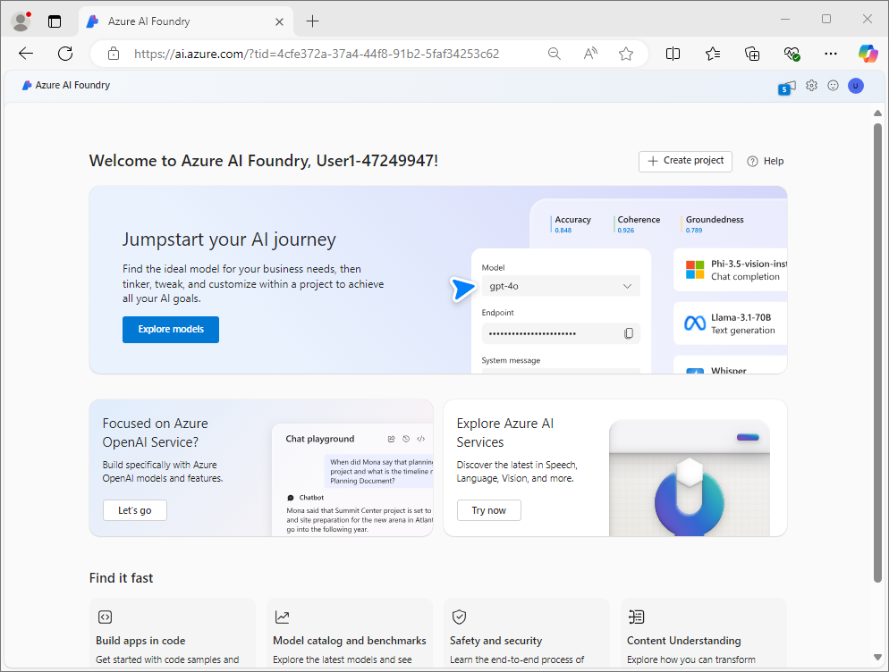
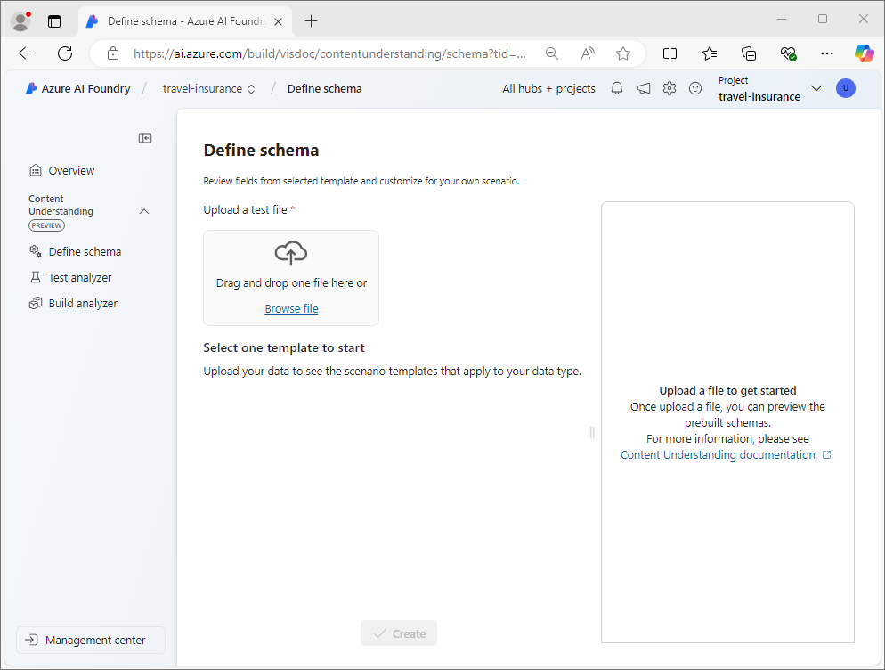
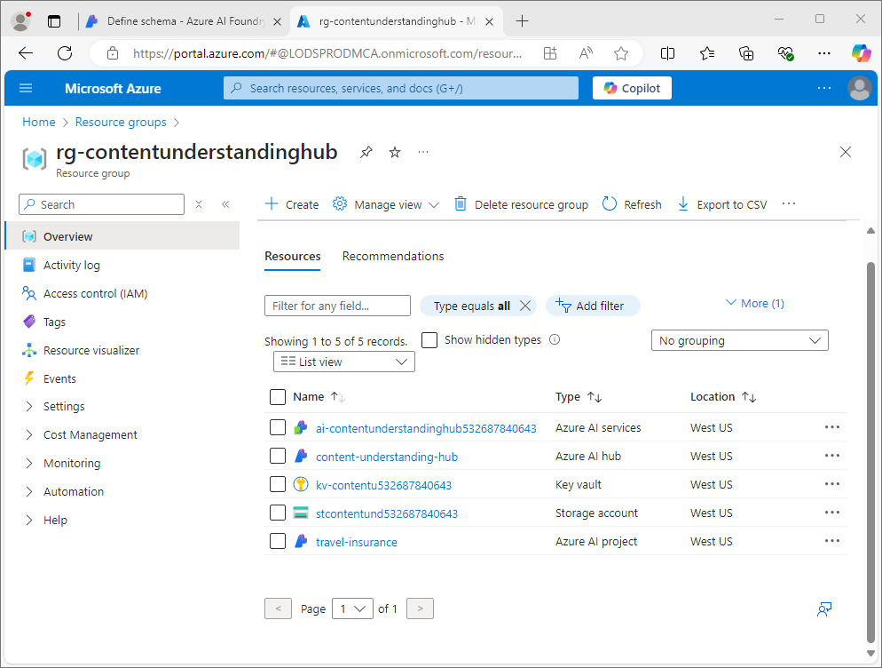

---
lab:
    title: 'Analyze documents with Azure AI Content Understanding'
---

# Analyze documents with Azure AI Content Understanding

In this exercise, you use Azure AI Foundry portal to create a Content Understanding project that can extract information from travel insurance policy forms. You'll then test your content analyzer in Azure AI Foundry Portal and consume it through the Content Understanding REST interface.

This exercise takes approximately **30** minutes.

## Create a Content Understanding project

Let's start by using the Azure AI Foundry portal to create a Content Understanding project.

1. In a web browser, open the [Azure AI Foundry portal](https://ai.azure.com) at `https://ai.azure.com` and sign in using your Azure credentials.

    The home page of Azure AI Foundry portal looks similar to the following image:

    

1. In the **Find it fast** section of the home page, towards the bottom, select **Content Understanding**.
1. On the **Content Understanding** page, select the **Create new Content Understanding project** button.
1. On the **Project overview** step, set the following properties for your project; then select **Next**:
    - **Project name**: `travel-insurance`
    - **Description**: `Insurance policy data extraction`
    - **Hub**: Create a new hub
1. On the **Create a hub** step, set the following properties and then select **Next**:
    - **Azure AI Hub resource**: `content-understanding-hub`
    - **Azure subscription**: *Select your Azure subscription*
    - **Resource group**: *Create a new resource group with an appropriate name*
    - **Location**: *Select any available location*
    - **Azure AI services**: *Create a new Azure AI services resource with an appropriate name*
1. On the **Storage settings** step, specify a new AI Hub storage account and select **Next**.
1. On the **Review** page, select **Create project**. Then wait for the project and its related resources to be created.

    When the project is ready, it will open in the **Define schema** page.

    

## Review Azure resources

When you created the AI Hub and project, various resources were created in your Azure subscription to support the project.

1. In a new browser tab, open the [Azure portal](https://portal.azure.com) at `https://portal.azure.com`; signing in with your Azure credentials.
1. Browse to the resource group you created for your hub, and note the Azure resources that have been created.

    

## Define a custom schema

## Clean up

If you've finished exploring Azure AI Foundry portal, you should delete the resources you have created in this exercise to avoid incurring unnecessary Azure costs.

1. Return to the browser tab containing the Azure portal (or re-open the [Azure portal](https://portal.azure.com?azure-portal=true) in a new browser tab) and view the contents of the resource group where you deployed the resources used in this exercise.
1. On the toolbar, select **Delete resource group**.
1. Enter the resource group name and confirm that you want to delete it.
